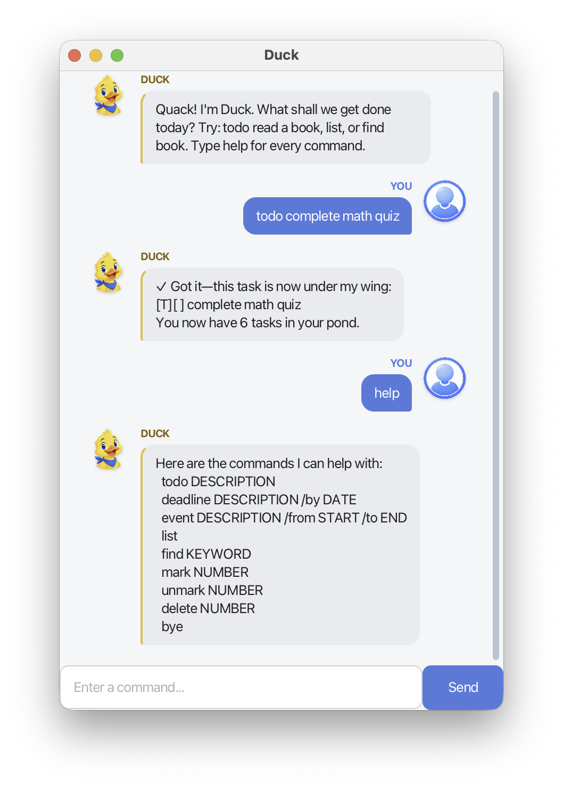

# Duck User Guide

Duck is a desktop task manager that helps you keep todos, deadlines, and events
in one place. Enter short text commands and Duck will save each successful
change for your next session.



## Contents

- [Quick start](#quick-start)
- [Reading command formats](#reading-command-formats)
- [Understanding the interface](#understanding-the-interface)
- [Command summary](#command-summary)
- [Managing tasks](#managing-tasks)
- [Duplicate tasks](#duplicate-tasks)
- [Saving tasks](#saving-tasks)
- [Exiting Duck](#exiting-duck-bye)

## Quick start

### Requirements

Duck requires Java 25.

Download `Duck.jar` from the
[latest GitHub release](https://github.com/mingshun2005/ip/releases/latest) and
place it in the folder where you want to keep Duck.

Open a terminal in that folder and launch Duck with:

```bash
java -jar Duck.jar
```

A window titled **Duck** will open. Type a command in the field at the bottom,
then press **Enter** or select **Send**. These two actions are equivalent.

For example:

```text
todo complete math quiz
```

Type `help` at any time to see a short command summary.

## Reading command formats

This guide shows command formats such as:

```text
deadline DESCRIPTION /by DATE
```

Words written in uppercase are placeholders that you must replace with your own
information. For example, replace `DESCRIPTION` with `submit report` and `DATE`
with `2026-10-15`.

Command words and separators shown in lowercase are literal. Enter `deadline`,
`/by`, `/from`, and `/to` exactly as shown.

A completed command therefore looks like:

```text
deadline submit report /by 2026-10-15
```

Descriptions and search keywords may contain spaces.

## Understanding the interface

- Your commands appear in blue bubbles on the right.
- Duck's replies appear in neutral bubbles with a yellow edge on the left.
- Errors appear in pale-red bubbles.
- A `✓` means that Duck successfully changed your task list.
- `[T]`, `[D]`, and `[E]` identify todos, deadlines, and events.
- `[ ]` means a task is active.
- `[X]` means a task is complete.

## Command summary

| Action | Command |
| --- | --- |
| Show command guidance | `help` |
| Add a todo | `todo DESCRIPTION` |
| Add a deadline | `deadline DESCRIPTION /by DATE` |
| Add an event | `event DESCRIPTION /from START /to END` |
| Show all tasks | `list` |
| Find matching tasks | `find KEYWORD` |
| Mark a task complete | `mark NUMBER` |
| Mark a task incomplete | `unmark NUMBER` |
| Delete a task | `delete NUMBER` |
| Exit Duck | `bye` |

## Managing tasks

### Adding a todo: `todo`

Use a todo for a task without a date or time.

**Format**

```text
todo DESCRIPTION
```

**Example**

```text
todo read a book
```

Duck adds the task and shows it as active:

```text
[T][ ] read a book
```

The description cannot be empty.

### Adding a deadline: `deadline`

Use a deadline for a task that must be completed by a specific date.

**Format**

```text
deadline DESCRIPTION /by DATE
```

#### Using an exact date

Enter the date in `yyyy-MM-dd` format. The month and day must contain two
digits.

```text
deadline submit report /by 2026-10-15
```

Duck displays the date in a more readable form:

```text
[D][ ] submit report (by: Oct 15 2026)
```

The date must be a real calendar date between the years `0001` and `9999`.
Formats such as `15-10-2026`, `2026-10-15 1800`, and `2026-2-3` are not
supported for deadlines.

#### Using a weekday

You may enter one of these three-letter English weekday abbreviations instead:

```text
Mon Tue Wed Thu Fri Sat Sun
```

Weekday abbreviations are case-insensitive, so `Mon`, `mon`, and `MON` are
equivalent.

```text
deadline submit report /by Mon
```

Duck resolves the weekday to its next occurrence after today and saves the
exact date. If today is Monday, `Mon` means the Monday of the following week.

Full weekday names and phrases such as `Monday`, `Tues`, and `next Mon` are not
supported.

### Adding an event: `event`

Use an event for an activity with a start and an end.

**Format**

```text
event DESCRIPTION /from START /to END
```

The description and both time fields are required.

#### Using free-form times

Event times may be entered as meaningful text:

```text
event project meeting /from Mon 2pm /to 4pm
```

Duck keeps free-form event times as entered:

```text
[E][ ] project meeting (from: Mon 2pm to: 4pm)
```

Free-form times are not converted into dates, and Duck does not compare their
order.

#### Using validated date-times

To let Duck validate the time range, enter both the start and end in
`yyyy-MM-dd HHmm` format using a 24-hour clock:

```text
event project meeting /from 2026-10-15 1400 /to 2026-10-15 1600
```

Duck shows:

```text
[E][ ] project meeting (from: 2026-10-15 1400 to: 2026-10-15 1600)
```

When both values use this format:

- Each date and time must be valid.
- The end cannot be earlier than the start.
- The start and end may be equal.
- An event may continue into a later day.

Automatic date-time validation applies only when both endpoints use the exact
structured format.

### Viewing tasks: `list`

Use `list` to display every task in its current order.

**Format**

```text
list
```

**Example result**

```text
Here are the tasks in your pond:
1.[T][ ] read a book
2.[D][ ] submit report (by: Oct 15 2026)
3.[E][X] project meeting (from: Mon 2pm to: 4pm)
```

If there are no tasks, Duck tells you that the pond is clear.

#### Understanding task numbers

The number at the start of each line is the task number used by `mark`,
`unmark`, and `delete`.

Task numbers can change when a task is deleted. Run `list` before using a
numbered command if you are unsure of the current number.

Search results from `find` keep each task's number from the full list. You can
use a number shown by `find` with `mark`, `unmark`, or `delete`.

### Finding tasks: `find`

Use `find` to search task descriptions.

**Format**

```text
find KEYWORD
```

**Example**

```text
find book
```

The search:

- Ignores uppercase and lowercase differences, so `book`, `Book`, and `BOOK`
  match the same descriptions.
- Accepts partial words and phrases.
- Searches descriptions only, not task types, completion status, dates, or
  event times.
- Shows matches in their original order.

For example, `find book` can match both `read a book` and
`return library books`.

If nothing matches, Duck reports that no matching tasks were found. The keyword
cannot be empty.

### Marking a task complete: `mark`

Use the task number shown by `list`.

**Format**

```text
mark NUMBER
```

**Example**

```text
mark 2
```

Duck changes the task's status from `[ ]` to `[X]` and confirms the change:

```text
[D][X] submit report (by: Oct 15 2026)
```

`NUMBER` must be a valid task number. Duck reports an error if the task is
already complete.

### Marking a task incomplete: `unmark`

Use `unmark` to make a completed task active again.

**Format**

```text
unmark NUMBER
```

**Example**

```text
unmark 2
```

Duck changes the task's status from `[X]` to `[ ]` and confirms the change.

`NUMBER` must be a valid task number. Duck reports an error if the task is
already active.

### Deleting a task: `delete`

Use `delete` to remove a task from the list.

**Format**

```text
delete NUMBER
```

**Example**

```text
delete 1
```

Deletion takes effect immediately, is saved automatically, and has no in-app
undo. Run `list` first and confirm that `NUMBER` belongs to the task you intend
to remove.

After deletion, Duck shows the removed task and the number of tasks remaining.
Tasks that followed the deleted task are renumbered.

### Showing help: `help`

Use `help` to display Duck's command summary inside the application.

**Format**

```text
help
```

This command does not change your tasks.

## Duplicate tasks

Duck rejects a new task when an existing task has the same:

- Task type and description for a todo
- Task type, description, and date for a deadline
- Task type, description, start, and end for an event

Completion status does not affect duplicate detection. For example, a completed
`todo read a book` still prevents another identical todo from being added.

Duplicate comparison is case-sensitive. Tasks with different types or different
details are allowed.

When Duck rejects a duplicate, it identifies the existing task number and
leaves the task list unchanged.

## Saving tasks

Duck automatically saves after every successful command that adds, marks,
unmarks, or deletes a task. You do not need to save manually.

When Duck is launched from the project root as shown above, tasks are stored in:

```text
data/duck.txt
```

The file and its folder are created automatically after the first successful
change. Duck reloads the saved tasks when you start it again.

Commands that only display information, such as `help`, `list`, and `find`, do
not change the saved file. Invalid commands also leave the task list unchanged.

## Exiting Duck: `bye`

To end the session, enter:

```text
bye
```

Duck displays a farewell message, disables both the input field and **Send**
button, and closes the window after three seconds. Any earlier successful
changes have already been saved.
